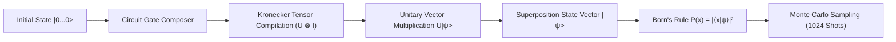

# ⚛️ Quantum Circuit Simulator

[](https://opensource.org/licenses/MIT)
[](https://www.python.org/)
[](https://numpy.org)

High-performance arbitrary N-qubit quantum state vector simulator and circuit compiler supporting Kronecker tensor product gate compilation and Monte Carlo measurement collapse.

---

## 🏛️ Simulation Architecture



## 🚀 Creating Entanglement (Bell State)

```python
from src.quantum.circuit import QuantumCircuit
from src.quantum.measurement import QuantumMeasurement

# Build Bell State (|00⟩ + |11⟩) / √2
qc = QuantumCircuit(2)
qc.h(0).cnot(0, 1)

state = qc.execute()
print("State probabilities:", state.get_probabilities())

# Measure
shots = QuantumMeasurement.measure_shots(state, shots=1024)
print("Measurement counts:", shots)
# Output: {'00': 518, '11': 506}
```

## 📜 License
MIT License. Built by [Shashank Shrivastva](https://github.com/shashankshrivastva-hue).
